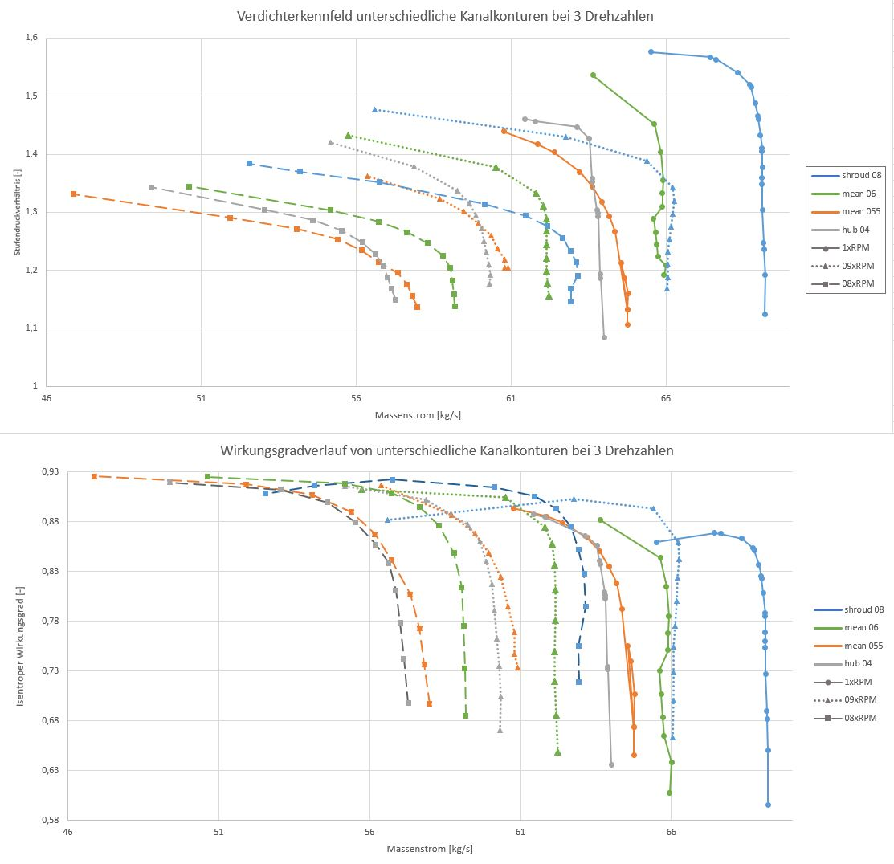
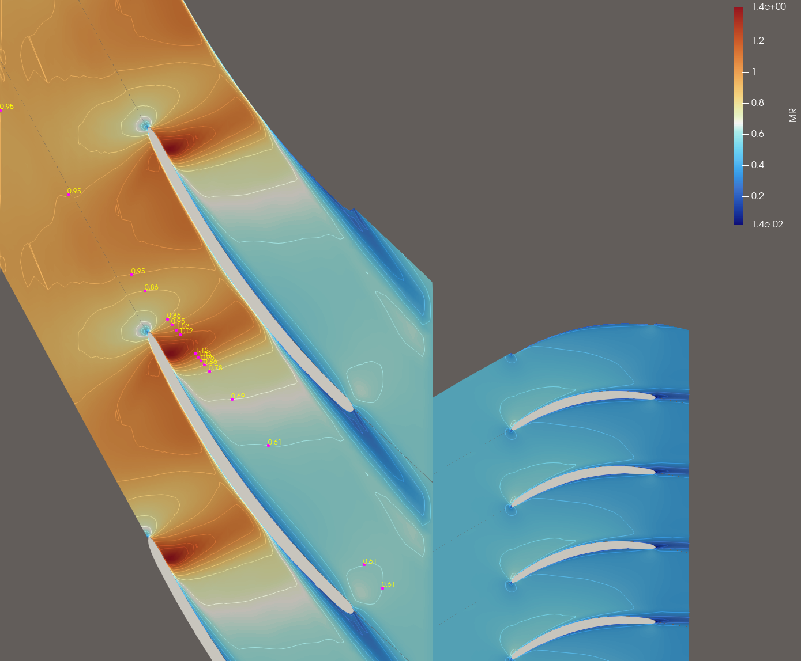

# MULTALL Stage Generator

A Python-based graphical preprocessor replacing the Fortran-coded **MEANGEN** and **STAGEN** modules of the [MULTALL]([https://multall.com/](https://sites.google.com/view/multall-turbomachinery-design)) turbomachinery CFD solver suite.

---

## About

**MULTALL Stage Generator** is an open-source Python/Tkinter GUI application developed as part of the Bachelor's theses at **Fachhochschule Aachen University of Applied Sciences**, Faculty of Aerospace Engineering, in the course *Turbomachinery Design and Analysis* supervised by **Prof. Grates**.

The project was originally initiated in 2025 by **Jonas Scholz** and **Luca De Francesco**, building upon foundational work by **Marco Wiens**, whose earlier Bachelor's thesis laid the groundwork for the Python-based replacement of MULTALL's preprocessing pipeline.

MULTALL is a well-established CFD solver for turbomachinery developed by John Denton at Cambridge University. Its preprocessing chain traditionally relies on two Fortran programs:

- **MEANGEN** — Meanline design and thermodynamic cycle analysis
- **STAGEN** — Streamline curvature and radial equilibrium calculations

This tool replaces both with a modern, interactive GUI, making the preprocessing workflow more accessible, maintainable, and extensible for students and researchers.

---

## Features

- Full GUI-based input for all meanline and radial equilibrium parameters via Python Tkinter
- JSON-based project files — save, load, and share design configurations easily
- Meanline design (MEANGEN replacement) with thermodynamic cycle calculations
- Radial equilibrium / streamline curvature (STAGEN replacement)
- Single-stage and multi-stage support with bleed air modelling, variable channel contours and freely adjustable grids
- Live result visualization with integrated plots
- Direct output of MULTALL-compatible input files for the CFD solver

---

## Results & Visualization

<table>
  <tr>
    <td width="50%">
      <strong>Compressor Map</strong> generated from MULTALL simulation data:<br><br>
      The compressor map was produced by running multiple MULTALL simulations across varying inlet conditions and channel contours. Each curve represents a different channel geometry, allowing direct comparison of aerodynamic performance across design variants.
    </td>
    <td width="50%">
      <strong>ParaView flow visualization</strong> inside rotor and stator:<br><br>
      The flow field visualization was created using <a href="https://www.paraview.org/">ParaView</a>, an open-source data analysis and visualization tool. It shows the internal flow structure through the rotor and stator passages as computed by the MULTALL CFD solver.
    </td>
  </tr>
  <tr>
    <td width="50%">
      
    </td>
    <td width="50%">
      
    </td>
  </tr>
</table>

## Installation

### Requirements

-  Python 3.9 or higher
- The following third-party Python packages:

```bash
pip install numpy matplotlib scipy
```

The following packages are part of the Python standard library and require no separate installation: `tkinter`, `os`, `sys`, `shutil`, `json`, `math`, `csv`, `subprocess`, `pathlib`, `atexit`.

> **Note:** `tkinter` is included with most standard Python installations. If missing, install via your OS package manager (e.g. `sudo apt install python3-tk` on Ubuntu).

### Clone the Repository

```bash
git clone https://github.com/jonas0403/MULTALL-Stage-Generator.git
cd MULTALL-Stage-Generator
```

### Run the Application

```bash
python main.py
```

---

## Usage

1. Launch the GUI via `python main.py`
2. On startup, all values are automatically loaded from the project JSON file into the GUI input fields
3. Adjust your turbomachinery design parameters in the input panels (inlet/outlet geometry, thermodynamic conditions, stage count, bleed air settings, etc.) — or edit the JSON file directly before launching
4. Save your current configuration at any time via the GUI to preserve your settings in the JSON file
5. Run the meanline and radial equilibrium calculations
6. Review results in the visualization panels
7. Export the MULTALL-compatible output files for use with the CFD solver

## JSON Project Files

All calculation inputs are stored in a single `.json` file. This file serves as both the persistent settings store and the input format for the calculation backend. You can either configure everything through the GUI or write values directly into the JSON before starting. Saving from the GUI overwrites the JSON with the current state, making it easy to version-control or share specific design configurations.

---

## Roadmap

### In Progress

| # | Feature | Status |
|---|---------|--------|
| 1 | Functioning output file generator for MULTALL | In Progress |
| 2 | Multi-stage calculation outputs | In Progress |
| 3 | Full bleed air implementation for multi-stage use (currently only working in Stage 1) | In Progress |

### Planned Future Features

| # | Feature |
|---|---------|
| 4 | Changing the meanline calculation to accept more or less than three stages
| 5 | Automatic bash file generation to run multiple simulations with varying inlet pressures for compressor map generation |
| 6 | Integrated compressor map plotting tool |
| 7 | Automatic simulation launch in a separate command window |

Contributions towards any of these are especially welcome — see [Contributing](#contributing) below.

---

## Contributing

Forks and pull requests are welcome and encouraged.

If you want to contribute:

1. **Fork** this repository
2. Create a new branch for your feature or fix: `git checkout -b feature/your-feature-name`
3. Commit your changes with clear messages
4. Open a **Pull Request** describing what you changed and why

Please make sure your code is reasonably documented and does not break existing functionality before submitting a PR.

---

## Project Structure

```
MULTALL-Stage-Generator/
├── main.py                             # Entry point
├── src/
│   ├── GUI.py                          # Main GUI application
│   ├── Stage_v3_working_with_bleedair.py  # Core stage calculation logic
│   ├── Bezier_curve.py                 # Blade geometry (Bezier)
│   ├── Channel_v2.py                   # Flow channel geometry
│   ├── Cubspline_function_v2.py        # Cubic spline interpolation
│   ├── Fixed_radii_Meanline_GUI_v4.py  # Meanline GUI module
│   ├── Functions_losses.py             # Loss model functions
│   ├── Interpolation.py                # Interpolation utilities
│   ├── output.py                       # Output file generation
│   ├── plot_channel.py                 # Channel visualization
│   ├── Radial_equilibrium.py           # Radial equilibrium solver
│   ├── run_multall.py                  # MULTALL solver interface
│   ├── Thermodynamic_calc_GUI.py       # Thermodynamics GUI module
│   └── var_Grid.py                     # Variable grid utilities
├── misc_functions/
│   ├── add_data_from_files.py
│   ├── create_dat_files.py
│   ├── create_run_file.py
│   └── plotting_data_for_verdichterkennfeld_v4_sorted.py
└── static/
    ├── Populated_data.json             # Example project file
    ├── Meanline_Initial_Values.txt     # Default meanline values
    ├── Thermo_Initial_Values.txt       # Default thermodynamic values
    └── Diameter_Values.txt             # Default diameter values
```

---

## Background & References

- **MULTALL** — J.D. Denton, Cambridge University (turbomachinery CFD solver)
- **MEANGEN / STAGEN** — Original Fortran preprocessing programs by J.D. Denton
- **Turbomachinery Design and Analysis** — Course at FH Aachen, Faculty of Aerospace Engineering, Prof. Grates
- **Marco Wiens** — Original Python preprocessing codebase (Bachelor's Thesis, FH Aachen)
- **Jonas Scholz & Luca De Francesco** — GUI development, restructuring, and multi-stage extensions (Bachelor's Theses, FH Aachen, 2025)

---

## License

This project is intended for academic use. Please contact the authors or FH Aachen for licensing clarifications before using this in a commercial context.

---

## Contact

For questions related to the project, feel free to open a GitHub Issue or reach out via the FH Aachen Faculty of Aerospace Engineering.
