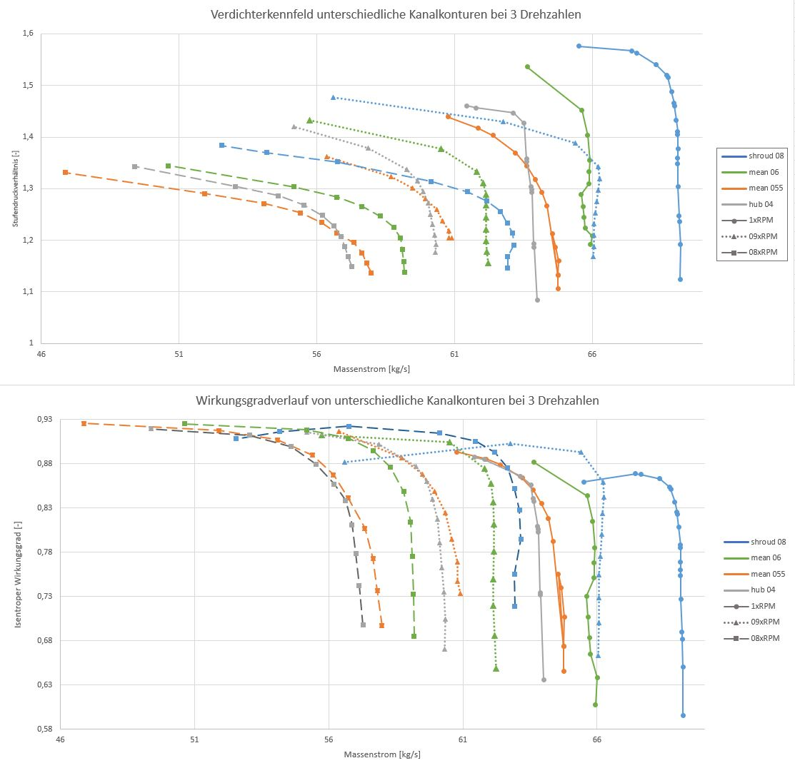
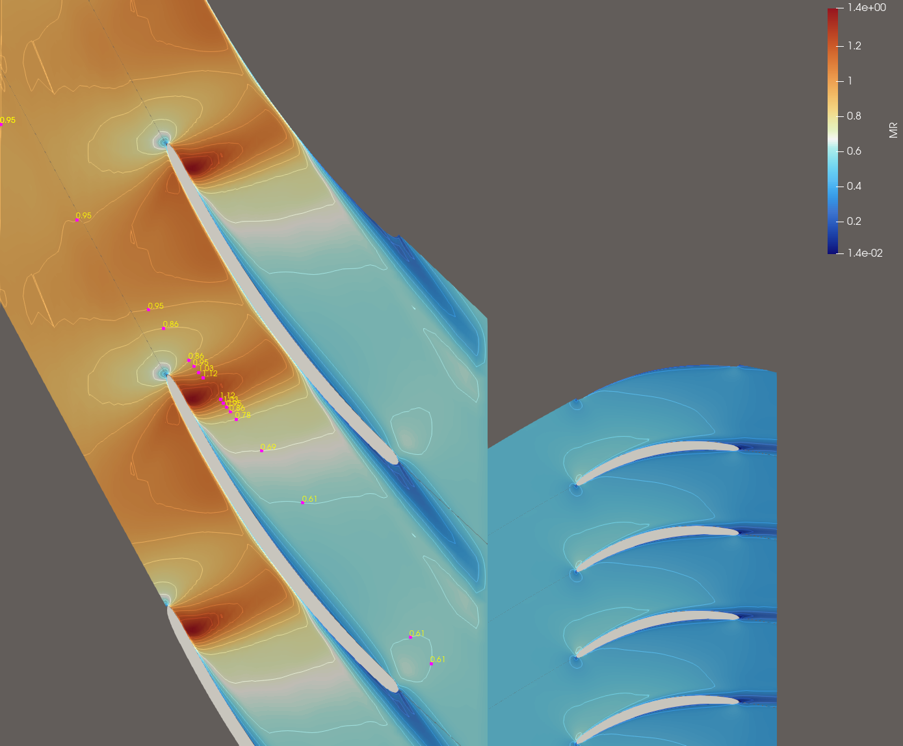

# MULTALL Stage Generator

A Python-based graphical preprocessor replacing the Fortran-coded **MEANGEN** and **STAGEN** modules of the [MULTALL](https://sites.google.com/view/multall-turbomachinery-design) turbomachinery CFD solver suite.

---

## Table of Contents

- [About](#about)
- [Features](#features)
- [Results & Visualization](#results--visualization)
- [Quickstart](#quickstart)
- [Usage](#usage)
- [Project Structure](#project-structure)
- [JSON Project Files](#json-project-files)
- [Roadmap](#roadmap)
- [Contributing](#contributing)
- [Background & References](#background--references)
- [License](#license)
- [Contact](#contact)

---

## About

**MULTALL Stage Generator** is an open-source Python/Tkinter GUI application developed as part of Bachelor's theses at **FH Aachen University of Applied Sciences**, Faculty of Aerospace Engineering, in the course *Turbomachinery Design and Analysis* supervised by **Prof. Grates**.

The project was originally initiated in 2025 by **Jonas Scholz** and **Luca De Francesco**, building upon foundational work by **Marco Wiens**, whose earlier Bachelor's thesis laid the groundwork for the Python-based replacement of MULTALL's preprocessing pipeline.

MULTALL is a well-established CFD solver for turbomachinery developed by John Denton at Cambridge University. Its preprocessing chain traditionally relies on two Fortran programs:

- **MEANGEN** — Meanline design and thermodynamic cycle analysis
- **STAGEN** — Streamline curvature and radial equilibrium calculations

This tool replaces both with a modern, interactive GUI, making the preprocessing workflow more accessible, maintainable, and extensible for students and researchers.

---

## Features

- **Full GUI** — Tkinter-based input for all meanline, radial equilibrium, and grid parameters
- **JSON project files** — Save, load, and share complete design configurations
- **Meanline design** — Thermodynamic cycle calculation with multi-stage support
- **Radial equilibrium** — Streamline curvature solver with configurable span sections
- **Multi-stage** — Supports single-stage and multi-stage compressors with bleed air modelling
- **Blade profiling** — Bezier-curve blade angle profiles with automatic generation from radial equilibrium
- **Grid generation** — Variable grid with configurable sections, levels, and refinement
- **MULTALL export** — Direct `.dat` output file generation compatible with the MULTALL solver
- **Headless pipeline** — Run the full workflow from the command line without the GUI
- **Compressor maps** — Generate multiple `.dat` files with varying pressure ratios and batch run scripts
- **Debug logging** — Comprehensive debug output with timestamps, sections, and context tags
- **Config history** — Every successful generation snapshots to `static/history/` with one-click import
- **Turbulence & Q3D options** — Spalart–Allmaras model switch and quasi-3D single-section mode
- **Input guardrails** — Blade-profile validation fails fast with a clear message instead of a solver crash

---

## Results & Visualization

<table>
  <tr>
    <td width="50%">
      <strong>Compressor Map</strong> generated from MULTALL simulation data:<br><br>
      The compressor map was produced by running multiple MULTALL simulations across varying inlet conditions and channel contours. Each curve represents a different channel geometry, allowing direct comparison of aerodynamic performance across design variants.
    </td>
    <td width="50%">
      <strong>ParaView flow visualization</strong> inside rotor and stator:<br><br>
      The flow field visualization was created using <a href="https://www.paraview.org/">ParaView</a>, an open-source data analysis and visualization tool. It shows the internal flow structure through the rotor and stator passages as computed by the MULTALL CFD solver.
    </td>
  </tr>
  <tr>
    <td width="50%">
      
    </td>
    <td width="50%">
      
    </td>
  </tr>
</table>

---

## Quickstart

### Requirements

- Python 3.9 or higher
- Third-party packages:

```bash
pip install -r requirements.txt
```

The following packages are part of the Python standard library: `tkinter`, `os`, `sys`, `shutil`, `json`, `math`, `csv`, `subprocess`, `pathlib`.

> **Note:** `tkinter` is included with most standard Python installations. If missing, install via your OS package manager (e.g. `sudo apt install python3-tk` on Ubuntu).

### Clone & Run

```bash
git clone https://github.com/jonas0403/MULTALL-Stage-Generator.git
cd MULTALL-Stage-Generator
python main.py
```

> **First run:** the repo ships only the template `static/Populated_data.template.json`. Copy it to `static/Populated_data.json` before the first run — the template is only a structural reference with placeholder values to help you understand the file format, not a real design.

> ```powershell
> Copy-Item static/Populated_data.template.json static/Populated_data.json
> ```

### Headless Pipeline (No GUI)

For automated or debugging runs without the GUI:

```bash
python main.py --headless --json static/Populated_data.json --output outputFiles
```

This runs the full workflow — meanline, radial equilibrium, blade profiling, and grid generation — and writes the MULTALL `.dat` file and a debug log to the output directory. The JSON file is updated in place with the regenerated blade profiles, metadata, and grid data.

> **Tip:** the headless run writes results back into the JSON file. Always run
> it on a copy, never the live file. (The GUI path instead snapshots every
> successful generation into `static/history/`.)

### Testing

```bash
pip install -r requirements-dev.txt
pytest
```

43 tests covering splines, Bezier math, meanline, radial equilibrium, channel
geometry, grid helpers, plus an end-to-end headless pipeline run with `.dat`
validation. Tests run on temp copies only — they never touch `static/*.json`,
`outputFiles/`, or `Run_Multall/`.

---

## Usage

### GUI Mode

1. Launch the application: `python main.py`
2. On startup, values are loaded from the project JSON file into the GUI input fields
3. Configure your design across the tabs (0D-Settings, 1D-Settings, 3D-Settings, Grid-Settings, Other-Settings)
4. Save your configuration at any time via the GUI
5. Run the meanline and radial equilibrium calculations
6. Review results in the visualization panels
7. Generate blade profiles from the radial equilibrium data
8. Export the MULTALL-compatible `.dat` output file

### Parametric MULTALL Studies

The "Other-Settings" tab provides tools for running parametric MULTALL studies.
It generates and solves multiple cases (e.g. across back pressures) whose
results can then be postprocessed into a compressor map — map plotting itself
is future work (see Roadmap).

1. Generate a single grid `.dat` file via the grid generation workflow
2. Enable "Create multiple DAT files for compressor map"
3. Configure the pressure range (start, end, step) and filename template
4. Click "Generate Outputfile" to create multiple `.dat` files with varying back pressure
5. A batch script (`run_multall_files.bat`) is generated to execute all cases through MULTALL
6. Check "Run MULTALL after generation" to launch the solver automatically

### Configuration Files

| File | Purpose |
|------|---------|
| `static/Populated_data.json` | Main project file — all design parameters (created from the template on first run) |
| `static/Populated_data.template.json` | Template with placeholder values — reference for the JSON structure |
| `static/history/` | Auto-saved config snapshots from every successful generation (gitignored) |

---

## Project Structure

```
MULTALL-Stage-Generator/
├── main.py                              # Entry point (GUI or headless, source/ tree)
├── requirements.txt                     # Runtime dependencies (numpy, matplotlib)
├── requirements-dev.txt                 # Dev dependencies (pytest)
├── pytest.ini                           # Test configuration
├── source/                              # Working code (refactored, ~500 lines/file max)
│   ├── headless.py                      # Headless pipeline driver (python -m source.headless)
│   ├── solver_run.py                    # MULTALL solver launcher dialog
│   ├── core/
│   │   ├── meanline/                    # 0D/1D: thermodynamics, meanline solver (split)
│   │   ├── radial/                      # Radial equilibrium solver
│   │   ├── geometry/                    # Channel, splines, Bezier, interpolation, plots
│   │   ├── stage/                       # Blade profiles, sections, coordinates, grid prep (split)
│   │   └── grid/                        # MULTALL .dat writers (incl. bleed, Q3D, SA cards)
│   ├── gui/                             # Tkinter GUI: app shell, tab modules, dialogs, widgets
│   ├── io/                              # Path resolution (repo root, static, output)
│   └── logging/                         # Structured debug logging
├── src/                                 # Frozen original (pre-refactor reference, read-only)
├── tests/                               # Pytest suite (43 tests, mirrors source/ imports)
├── tools/                               # .dat validator, debug analysis helpers
├── misc_functions/                      # Headless runner (src/), compressor-map + plotting helpers
├── static/
│   ├── Populated_data.template.json     # Committed template with placeholder values
│   └── image/                           # Screenshots and visualizations
├── Docs/                                # MULTALL reference documentation
└── Run_Multall/                         # MULTALL solver binaries
```

---

## JSON Project Files

All calculation inputs are stored in a single `.json` file. This file serves as both the persistent settings store and the input format for the calculation backend. You can either configure everything through the GUI or write values directly into the JSON before starting.

The JSON is structured into the following top-level sections:

| Section | Description |
|---------|-------------|
| `Thermodynamic_input_data` | RPM, mass flow, pressure ratio, efficiencies, gas properties |
| `Meanline_input_data` | Per-stage diameters, chord lengths, blade counts, solidity, angles |
| `Diameter_data` | Hub, mean, and shroud diameter distributions |
| `Bezier_point_data` | Blade angle control points for Bezier profiling |
| `Metadata` | Grid settings, output paths, levels configuration |
| `Grid_data` | Grid dimensions (IM, JM, KM), section definitions |
| `Bleed_air_data` | Bleed air mass flow and position per stage |
| `Intake_Outtake_area` | Inlet and outlet duct areas |

A template file with placeholder values is available at `static/Populated_data.template.json`.

---

## Roadmap

### In Progress

| # | Feature |
|---|---------|
| 1 | **`src/` port backlog** — apply the source/-only fixes to the frozen tree before the final swap |
| 2 | **Extensive code validation** — verify calculation correctness across all configurations |

### Planned

| # | Feature |
|---|---------|
| 1 | **Undo/Redo** — track edit history on JSON fields for safe experimentation |
| 2 | **Integrate compressor map plotting pipeline** — extract data from `global_*.csv`, calculate derived values, merge across MULTALL runs, feed into plotting program |
| 3 | **Add cmd output save option to GUI auto run** — save console output to `.md`/`.txt` instead of just displaying it |
| 4 | **User-defined blade profiles** — import custom blade angle distributions from CSV |
| 5 | **Plotting dashboard** — dedicated tab with real-time plots of velocity triangles, stage loading, reaction, efficiency vs. stage |
| 6 | **Design of Experiments** — parametric sweeps over multiple variables (chord, solidity, RPM) for automated trade studies |
| 7 | **Automated map pipeline** — auto-solve variants with live progress GUI, postprocessing loop, configurable compressor-map plot |

---

## Contributing

Forks and pull requests are welcome.

1. **Fork** this repository
2. Create a new branch for your feature or fix: `git checkout -b feature/your-feature-name`
3. Commit your changes with clear messages
4. Open a **Pull Request** describing what you changed and why

Please ensure your code is reasonably documented and does not break existing functionality before submitting.

---

## Background & References

- **MULTALL** — J.D. Denton, Cambridge University — Turbomachinery CFD solver
- **MEANGEN / STAGEN** — Original Fortran preprocessing programs by J.D. Denton
- **Turbomachinery Design and Analysis** — Course at FH Aachen, Faculty of Aerospace Engineering, Prof. Grates
- **Marco Wiens** — Original Python preprocessing codebase (Bachelor's Thesis, FH Aachen)
- **Jonas Scholz & Luca De Francesco** — GUI development, restructuring, and multi-stage extensions (Bachelor's Theses, FH Aachen, 2025)

---

## License

This project is intended for academic use. Please contact the authors or FH Aachen for licensing clarifications before using this in a commercial context.

---

## Contact

For questions related to the project, feel free to open a [GitHub Issue](https://github.com/jonas0403/MULTALL-Stage-Generator/issues) or reach out via the FH Aachen Faculty of Aerospace Engineering.
